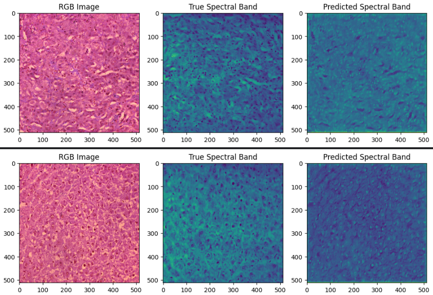

# Hyperspectral Image Processing with U-Net

This repository contains a project for processing hyperspectral images using a U-Net model. The project includes scripts for loading and processing images, defining the U-Net model, training the model, and visualizing the results.

The project is organized into the following files:

- `load_and_process_images.py`: This script is responsible for loading and preprocessing RGB and hyperspectral images.
- `unet_model.py`: This script defines the U-Net model architecture used for processing images.
- `train_model.py`: This script trains the U-Net model using the preprocessed images.
- `visualize_results.py`: This script visualizes the results of the trained model on test images.

Sample result image obtained as model output;

- 
